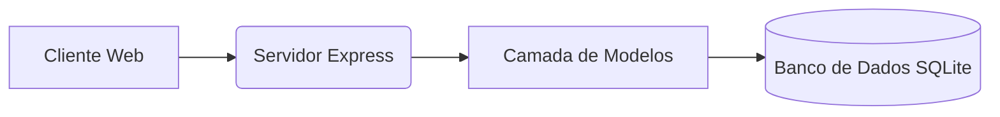
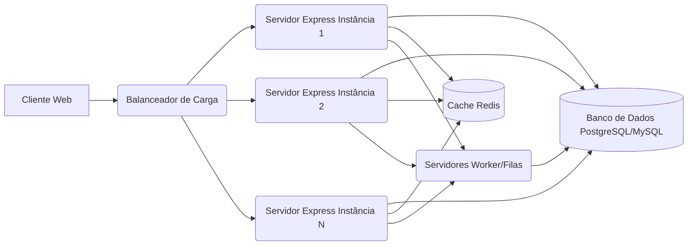

# Estratégia de Escalabilidade - LASCMMG

## 📈 Preparando o Sistema para Crescer: Otimização e Arquitetura para Alta Performance

Este documento detalha a estratégia de escalabilidade do Sistema de Gerenciamento de Torneios de Sinuca (LASCMMG). Nosso objetivo é garantir que o sistema possa crescer de forma sustentável, mantendo alta performance, confiabilidade e disponibilidade à medida que o número de usuários, torneios e a carga de trabalho aumentam.

Abordamos desde otimizações na configuração atual com SQLite até planos futuros para arquiteturas distribuídas.

## 📑 Índice

1.  [Visão Geral e Considerações](#visão-geral-e-considerações)
2.  [Métricas Chave de Monitoramento](#métricas-chave-de-monitoramento)
3.  [Estratégias de Escalabilidade](#estratégias-de-escalabilidade)
    *   [Escalabilidade Vertical](#escalabilidade-vertical)
    *   [Escalabilidade Horizontal (Plano Futuro)](#escalabilidade-horizontal-plano-futuro)
4.  [Otimização de Banco de Dados (SQLite)](#otimização-de-banco-de-dados-sqlite)
5.  [Otimização de Código (Backend e Frontend)](#otimização-de-código-backend-e-frontend)
6.  [Arquitetura Atual e Evolução](#arquitetura-atual-e-evolução)
7.  [Cache](#cache)
8.  [Monitoramento e Alertas](#monitoramento-e-alertas)
9.  [Roadmap de Escalabilidade](#roadmap-de-escalabilidade)

## 1. Visão Geral e Considerações

O LASCMMG, em sua configuração atual, utiliza Node.js/Express com SQLite. Esta arquitetura é eficiente e simples de gerenciar para a maioria dos casos de uso, especialmente para torneios de pequeno a médio porte. No entanto, o SQLite possui limitações inerentes de concorrência de escrita que se tornam um fator limitante em cenários de altíssima escala ou com picos extremos de escrita simultânea.

Nossa estratégia de escalabilidade considera:

*   **Padrão de Uso:** O tráfego tende a ser maior durante a realização de torneios, com períodos de menor atividade entre eles.
*   **Crescimento:** Prevemos um crescimento contínuo na base de usuários e no volume de dados (torneios, jogadores, placares).
*   **Evolução Planejada:** A arquitetura atual é uma base sólida, mas planejamos evoluir para soluções mais robustas (como bancos de dados cliente-servidor e arquiteturas distribuídas) conforme a necessidade.

## 2. Métricas Chave de Monitoramento

Monitoramos continuamente as seguintes métricas para identificar gargalos e determinar o momento ideal para escalar:

| Métrica           | Descrição                                                                 | Limiar para Ação de Escala | Ferramentas de Monitoramento (Exemplos)        |
| :---------------- | :------------------------------------------------------------------------ | :------------------------- | :--------------------------------------------- |
| **Uso de CPU**    | Percentual médio de utilização da CPU do servidor.                        | >70% por 15 minutos        | Prometheus/Grafana, CloudWatch, Monitoramento SO |
| **Uso de Memória**| Percentual de memória RAM utilizada pelo processo da aplicação.           | >80% por 10 minutos        | Prometheus/Grafana, CloudWatch, Monitoramento SO |
| **Tempo de Resposta**| Latência média das requisições da API.                                    | >500ms para 95% das req.   | Sentry APM, New Relic, Prometheus              |
| **Taxa de Erro**  | Percentual de respostas da API com status de erro (HTTP 5xx).             | >1% em janela de 5 minutos | Sentry, Logs da Aplicação                      |
| **I/O de Disco**  | Atividade de leitura/escrita no disco (especialmente relevante para SQLite).| Alto e constante           | Monitoramento SO                               |
| **Tamanho do DB** | Crescimento do arquivo `data/data.db`.                                    | > Limite de armazenamento  | Monitoramento SO, Script de Verificação        |
| **Conexões DB**   | (Relevante após migração para DB cliente-servidor) Número de conexões ativas.| >80% do pool configurado   | Ferramentas específicas do DB                  |

## 3. Estratégias de Escalabilidade

### Escalabilidade Vertical (Scale Up)

**Descrição:** Aumentar os recursos (CPU, memória, armazenamento) do servidor existente que hospeda a aplicação e o banco de dados SQLite.

**Quando Aplicar:**
*   Fase inicial e média do projeto, onde a carga ainda permite.
*   Para lidar com picos temporários de tráfego.
*   Quando a simplicidade operacional é a maior prioridade.

**Processo:** Geralmente envolve a atualização do plano de hospedagem em serviços de nuvem ou a adição de hardware em servidores dedicados. Requer um breve downtime para a aplicação.

**Limites:** Existe um limite físico e de custo para o quanto um único servidor pode ser escalado verticalmente. A concorrência de escrita do SQLite também impõe um limite inerente.

### Escalabilidade Horizontal (Scale Out) - Plano Futuro

**Descrição:** Distribuir a carga de trabalho entre múltiplas instâncias da aplicação. **Esta estratégia exige a migração do banco de dados SQLite para um sistema de banco de dados cliente-servidor (como PostgreSQL ou MySQL) que suporte múltiplas conexões concorrentes de forma eficiente.**

**Quando Aplicar:**
*   Quando a escalabilidade vertical atingir seus limites práticos ou de custo.
*   Para aumentar a disponibilidade e resiliência do sistema (se uma instância falhar, outras continuam operando).
*   Em cenários de alto tráfego sustentado.

**Preparação Necessária (Roadmap Futuro):**
1.  **Migração de Banco de Dados:** Planejar e executar a migração de dados de SQLite para um SGBD cliente-servidor (ex: PostgreSQL). Isso envolve a criação de um novo esquema e a transferência dos dados existentes.
2.  **Gestão de Estado Compartilhado:** Se houver necessidade de compartilhar estado entre instâncias (ex: cache de aplicação, filas de mensagens), implementar soluções como Redis. O uso atual de JWT para autenticação já ajuda, pois é stateless no servidor.
3.  **Armazenamento de Arquivos:** Se o sistema permitir upload de arquivos no futuro, será necessário usar um armazenamento compartilhado (ex: S3, Azure Blob Storage) acessível por todas as instâncias.

**Processo (Roadmap Futuro):**
1.  Configurar um **balanceador de carga** (Nginx, HAProxy, Load Balancer de nuvem) para distribuir as requisições entre as instâncias.
2.  Implantar a aplicação em **contêineres (Docker)** para facilitar a replicação e o gerenciamento de múltiplas instâncias.
3.  Considerar um sistema de **orquestração de contêineres** (Kubernetes, Docker Swarm) para automatizar a implantação, escalonamento e gerenciamento das instâncias.
4.  Implementar **autoscaling** baseado em métricas (se o ambiente de hospedagem suportar).

## 4. Otimização de Banco de Dados (SQLite)

Mesmo com SQLite, há otimizações cruciais para melhorar a performance e a longevidade:

*   **Índices:** Garantir que todas as colunas frequentemente usadas em cláusulas `WHERE`, `JOIN`, e `ORDER BY` possuam índices apropriados. O esquema inicial em `lib/database.js` já inclui índices essenciais, mas revisões periódicas são importantes.
*   **Otimização de Queries:** Analisar e refatorar consultas SQL lentas ou ineficientes nos modelos (`lib/models/`).
*   **`VACUUM`:** Executar o comando `VACUUM` periodicamente para reconstruir o banco de dados, recuperar espaço não utilizado e melhorar a performance de I/O. Um script (`scripts/optimize-database.js` - a ser criado ou aprimorado) pode ser usado para isso.
*   **Modo WAL (Write-Ahead Logging):** Avaliar e implementar o modo WAL (`PRAGMA journal_mode=WAL;`) para melhorar a concorrência de leitura/escrita em cenários onde há leituras frequentes e escritas simultâneas.

## 5. Otimização de Código (Backend e Frontend)

Otimizações no código da aplicação são contínuas:

### Backend (Node.js/Express)

*   **Otimização de Consultas DB:** (Já mencionado) É o gargalo mais comum.
*   **Paginação:** Implementar paginação para endpoints de API que retornam grandes listas de dados.
*   **Rate Limiting:** Já implementado para proteger contra abuso e garantir a disponibilidade (configurável via `.env`).
*   **Processamento Assíncrono:** Para tarefas que consomem tempo (ex: envio de emails, processamento de arquivos grandes), considerar movê-las para processos em background ou filas de mensagens para não bloquear o loop de eventos principal.

### Frontend (JavaScript Vanilla)

*   **Otimização de Assets:** Minificação e compressão de arquivos JS, CSS e imagens.
*   **Lazy Loading:** Carregar módulos JavaScript ou partes da interface apenas quando necessário.
*   **Cache de Navegador:** Configurar headers HTTP apropriados para cache de assets estáticos (já implementado em `server.js`).
*   **Otimização de Renderização:** Otimizar a manipulação do DOM e a renderização de listas grandes.

## 6. Arquitetura Atual e Evolução

### Arquitetura Atual (Monolítica com SQLite)

Esta arquitetura é simples, eficiente para o escopo atual e fácil de implantar.

### Arquitetura Futura (Considerações para Escala Horizontal)

Esta arquitetura distribuída permite escalar a camada de aplicação horizontalmente e utilizar um banco de dados mais robusto para alta concorrência.

## 7. Cache

Estratégias de cache para melhorar a performance:

1.  **Cache de Navegador:** Utilizar headers HTTP (`Cache-Control`, `ETag`) para que o navegador do usuário armazene assets estáticos e dados da API (já implementado para assets estáticos).
2.  **Cache de Aplicação (Backend):** Implementar um cache em memória ou distribuído (ex: Redis) para armazenar resultados de consultas frequentes ou dados computacionalmente caros, reduzindo a carga no banco de dados.
3.  **CDN (Content Delivery Network):** Utilizar uma CDN para servir assets estáticos globalmente, reduzindo a latência para usuários geograficamente distantes.

## 8. Monitoramento e Alertas

Um sistema de monitoramento robusto é essencial para identificar problemas de performance e capacidade antes que afetem os usuários.

*   **Métricas:** Monitorar as métricas chave listadas na Seção 2.
*   **Logs:** Utilizar um sistema de log centralizado (ex: ELK Stack, Grafana Loki) para agregar e analisar logs de múltiplas instâncias.
*   **Alertas:** Configurar alertas baseados nos limiares das métricas para ser notificado proativamente sobre possíveis problemas de escalabilidade ou performance. Ferramentas como Prometheus Alertmanager, Sentry ou sistemas de alerta de nuvem são úteis.

## 9. Roadmap de Escalabilidade

Nossa jornada de escalabilidade é dividida em fases:

### Fase 1: Otimização da Configuração Atual (SQLite) - Foco Principal

*   **[CONCLUÍDO]** Migração completa de dados de JSON para SQLite.
*   **[CONCLUÍDO]** Otimizar consultas SQL e garantir índices essenciais.
*   **[CONCLUÍDO]** Implementar monitoramento básico de saúde da aplicação (`/ping`, `/api/system/health`) e logs aprimorados (Pino).
*   **[CONCLUÍDO]** Implementar cache de assets estáticos robusto e headers de cache HTTP.
*   **[EM ANDAMENTO]** Avaliar e implementar o modo WAL para SQLite para melhorar a concorrência.
*   **[A FAZER]** Criar/aprimorar script de manutenção para `VACUUM` (`scripts/optimize-database.js`) e automatizar sua execução.
*   **[A FAZER]** Revisar e otimizar todas as consultas SQL nos modelos.

### Fase 2: Preparação para Escala Maior (Plano Futuro)

*   Avaliar e planejar detalhadamente a migração de SQLite para um SGBD cliente-servidor (PostgreSQL ou MySQL).
*   Introduzir Redis para cache de dados e, potencialmente, gerenciar a blacklist de tokens JWT e contadores de brute-force de forma centralizada.
*   Containerizar a aplicação com Docker e criar configurações `docker-compose` para ambientes de desenvolvimento e produção.
*   Implementar um pipeline de CI/CD básico para automatizar builds e deploys.

### Fase 3: Escala Horizontal e Resiliência (Plano Futuro Avançado)

*   Implementar balanceamento de carga (Nginx, HAProxy, ou Load Balancer de nuvem).
*   Implantar múltiplas instâncias da aplicação Node.js.
*   Considerar separar componentes em serviços menores (microserviços) se a complexidade e a necessidade de escala justificarem.
*   Implementar autoscaling se hospedado em ambiente de nuvem que suporte.
*   Utilizar CDN para servir assets estáticos.

---

Este documento será revisado e atualizado periodicamente para refletir o estado atual do sistema e os planos de crescimento.
